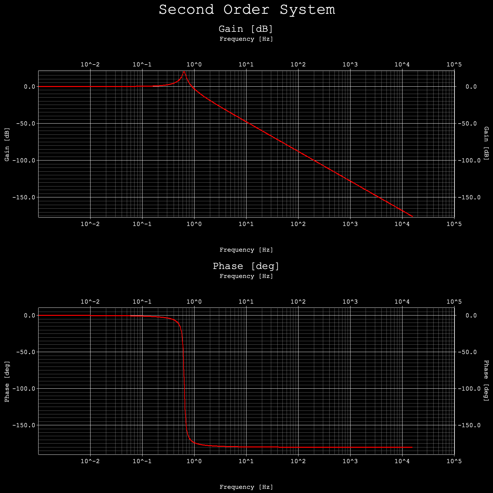
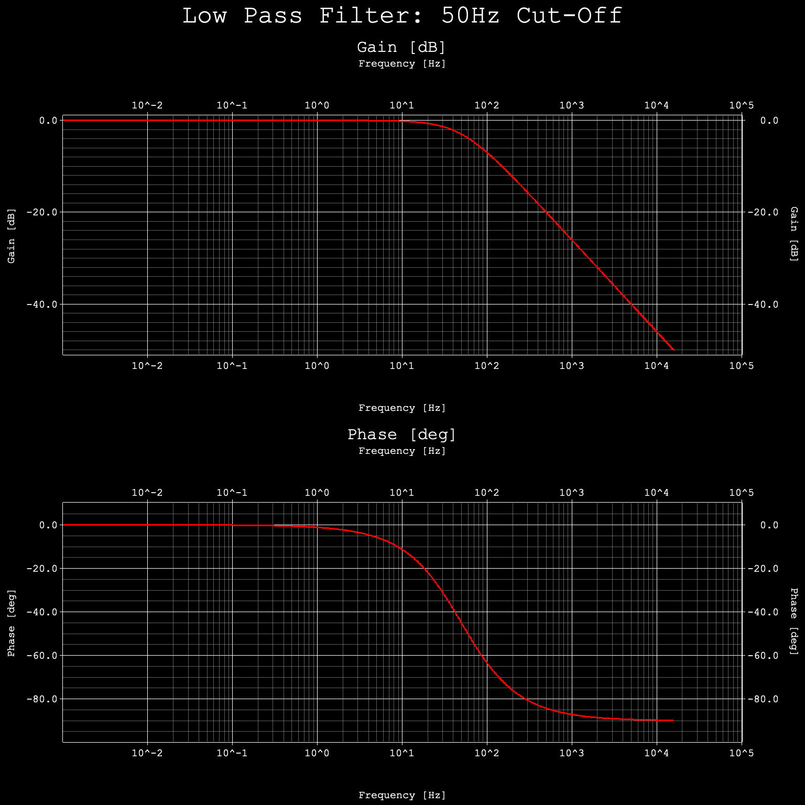

# Frequency Domain Utilities 
Practicing frequency domain analysis (Transfer functions, C2D, Bode Diagrams, etc.) and Rust.

Plots generated uses Rust's standard [Plotters](https://docs.rs/plotters/latest/plotters/) library.

## Transfer Functions 
Added support for generic transfer functions via `TransferFunction` struct. Example below shows Bode Plot of system with transfer function $\frac{\omega_0^2}{s^2 + 2\zeta\omega_0 s + \omega_0^2}$ with $\zeta=0.05$ and $\omega_0=4$.

## Filters

### Low Pass Filters
Added support for Low Pass Filters via `LowPassFilter` struct. Example below shows Bode Plot of a first-order Low Pass Filter with cut-off frequency of 50Hz:

